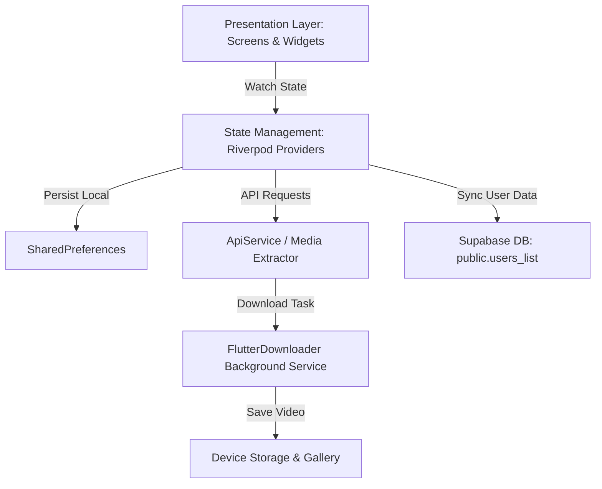

# AnySave — Modern Media Downloader App

Unduh Video TikTok & Instagram Tanpa Watermark Secara Gratis, Instan, dan Tanpa Ribet.

---

## Tentang AnySave

AnySave adalah aplikasi mobile cross-platform berbasis Flutter yang dirancang untuk memberikan pengalaman terbaik dalam menyimpan video dari TikTok dan Instagram langsung ke galeri HP tanpa watermark.

Aplikasi ini mengusung filosofi Ultra-Fast & Seamless Onboarding: tidak ada form pendaftaran panjang atau verifikasi email yang mengganggu. Pengguna cukup memasukkan nama pengguna sekali (1-kolom) untuk langsung menikmati seluruh fitur aplikasi secara instan.

---

## Fitur Utama

- **Tanpa Watermark**: Hasil unduhan video bersih dari watermark TikTok/Instagram.
- **Auto-Paste Link**: Membaca link video secara otomatis dari clipboard saat ditempel.
- **1-Column Fast Login**: Masuk aplikasi cukup mengetik nama pengguna tanpa password rumit.
- **Proteksi Rate Limiting**: Membatasi pendaftaran maksimal 3 akun baru per 10 menit untuk keamanan server.
- **Database Cloud Supabase**: Terhubung langsung dengan tabel Supabase users_list untuk pemantauan pengguna real-time.
- **Riwayat & Galeri**: Pengelolaan daftar riwayat unduhan lokal dengan thumbnail & detail media.
- **Multi-Theme Support**: Dukungan Mode Terang (Light Mode) dan Mode Gelap (Dark Mode).
- **Multi-Language**: Pilihan Bahasa Indonesia dan Bahasa Inggris.

---

## Tech Stack

| Kategori | Teknologi | Deskripsi |
|---|---|---|
| **Framework** | Flutter | Framework UI Cross-Platform (Android & iOS) |
| **Bahasa** | Dart | Bahasa Pemrograman Utama |
| **State Management** | Flutter Riverpod | Manajemen Status Reaktif & Terpusat |
| **Backend & Database** | Supabase | Database Cloud Real-time & API Client |
| **Downloader** | flutter_downloader | Service Unduhan Latar Belakang & Notifikasi |
| **Local Persistence** | shared_preferences | Penyimpanan Preferensi & Session Pengguna |
| **Networking** | dio & http | HTTP Client untuk Ekstraksi Media & API |

---

## Arsitektur Aplikasi



---

## Struktur Folder Proyek

```
AnySave/
├── anydesk-fe/                         # Proyek Utama Flutter App
│   ├── lib/
│   │   ├── main.dart                  # Entry Point & Setup Supabase/Riverpod
│   │   ├── data/
│   │   │   └── services/
│   │   │       └── api_service.dart   # Ekstraktor Link & Scraping Engine
│   │   ├── providers/
│   │   │   └── app_settings_provider.dart # State Providers (Auth, Theme, Lang)
│   │   ├── screens/
│   │   │   ├── main_navigation_wrapper.dart # Bottom Navigation Handler
│   │   │   ├── home_screen.dart       # Layar Utama Input Link
│   │   │   ├── history_screen.dart    # Layar Riwayat Unduhan
│   │   │   ├── settings_screen.dart   # Layar Pengaturan & Edit Profil
│   │   │   ├── sign_in_screen.dart    # Layar Log In 1-Kolom Nama
│   │   │   ├── downloading_screen.dart# Layar Status Progress Unduhan
│   │   │   └── video_preview_screen.dart # Layar Preview Video
│   │   ├── theme/
│   │   │   ├── app_colors.dart        # Palette Warna Aplikasi
│   │   │   └── app_theme.dart         # Konfigurasi Light & Dark Theme
│   │   └── widgets/
│   │       ├── platform_toggle.dart   # Toggle Platform TikTok / Instagram
│   │       ├── storage_banner.dart    # Banner Izin Storage
│   │       └── recent_download_card.dart # Preview Unduhan Terakhir
│   └── pubspec.yaml                   # File Manifest Package & Asset
└── README.md                          # Dokumentasi Utama Proyek
```

---

## Disclaimer

AnySave dikembangkan untuk keperluan edukasi dan penggunaan pribadi. Aplikasi ini tidak berafiliasi, disponsori, atau didukung oleh TikTok, Instagram, atau Meta Platforms, Inc. Pengguna bertanggung jawab penuh atas penggunaan konten sesuai hukum hak cipta yang berlaku.

---

## Lisensi

Proyek ini dilisensikan di bawah [MIT License](LICENSE).

